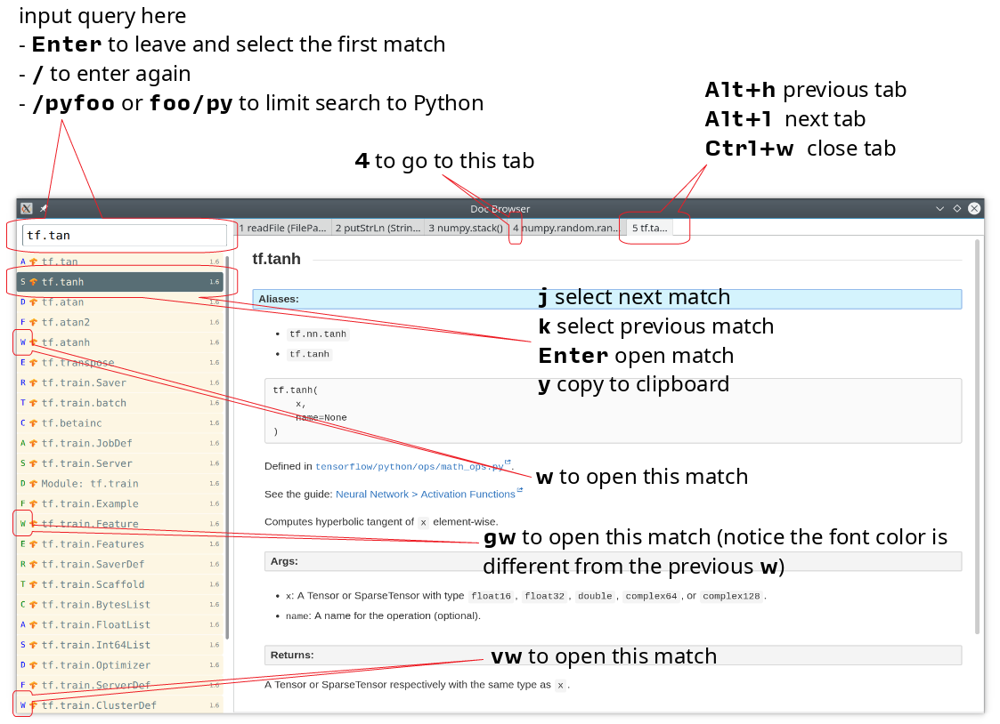

# doc-browser

An API documentation browser written in Haskell and QML.

## Screenshot

## Credits

This application is written by incomplete@aixon.co.

Many thanks to [Thibaut Courouble](https://github.com/Thibaut) and [other contributors](https://github.com/Thibaut/devdocs/graphs/contributors) of [DevDocs](https://github.com/Thibaut/devdocs), without their work, this application wouldn't be possible:

- This application ships with icons collected by DevDocs.

- This application uses docsets, along the corresponding style sheets, produced by DevDocs.

## Implemented Features

- Native desktop application

- Works offline

- Near real-time fuzzy search

- Easy-to-type shortcuts

## Planned Features (in no particular order)

- Hoogle integration

- Persistent tabs across application restarts

- Docsets management

- DBus interface

- Configurable

- Display version number

## Current Status

It's in early stage, the main interface is in shape and usable, but other aspects, like installing docsets and configuration, lack polishing. That being said, I use this application every day.

## Installation

Currently, this application can only be installed from source, and only tested on Linux, and the installation process is pretty rough. This will be improved in future versions.

1. Install the font [Input Mono](http://input.fontbureau.com/), it is free for personal use. (In a later version you can specify the font you want to use)

2. This application uses [Qt 5](http://qt-project.org/), make sure you have it installed. You also need [Qt WebEngine](https://wiki.qt.io/QtWebEngine), install it if it doesn't come with your Qt installation, on Arch Linux, this is provided by the [extra/qt5-webengine](https://www.archlinux.org/packages/extra/x86_64/qt5-webengine/) package.

3. Install the Haskell tool [stack](https://docs.haskellstack.org/en/stable/install_and_upgrade/).

4. The build process depends on an executable called `c2hs`, you can install it using your package manager, or use the instruction below.

5. You may also need an executable called `happy`, if the build process reports that this is missing, install it in a similar manner with c2hs.

Finally, run these commands in the shell to build and install the application:

    git clone 'https://github.com/qwfy/doc-browser.git'
    cd doc-browser

    # optionally, install `c2hs` if not already installed:
    # stack install c2hs

    stack install

    # optionally, install `happy` if the above command complains the lack of `happy`:
    # and run `stack install` again after the installation
    # stack install happy

    echo "binary installed to $(stack path --local-bin)"

Note, due to a restriction of stack, you shouldn't delete the `.stack-work` directory inside the source code directory you just cloned after the build, for the installed binary still need to access files in it. If you really don't want to depends on this `.stack-wrok` directory, you can copy the `ui` directory of this repository to somewhere, say `/foo/ui`, and then start this application with `doc_browser_datadir=/foo doc-browser` instead of the usual `doc-browser`. This annoying situation will be handled when this application gets a packaging system for various operating systems.

If you have trouble building this application, you can:

- Is it a dependency problem?
- Does [this page](http://www.gekkou.co.uk/software/hsqml/) help? Especially the _Requirements_ and _Installation_ section.
- Open an issue.

To install DevDocs' docset, invoke:

    doc-browser --install-devdocs 'DOC1 DOC2'
    # e.g. doc-browser --install-devdocs 'python haskell'

This will download docsets from devdocs.io, and unpack them to `XDG_CONFIG/doc-browser/devdocs`.

Start the application with:

    doc-browser

## GUI

- When the application starts, you will see a blank screen, you can start typing to search.

- Press "Enter" to accept query string.

- Press one of "ASDFWERTC", or "G" + one of "ASDFWERTC", or "V" + one of "ASDFWERTC" to open a match.

- "j" to select next match, and "k" to select the previous one, and "Enter" to open.

- Press one of "1234567890" to go to the corresponding tab.

- "Alt+h" to go to the previous tab, "Alt+l" to go to the next tab.

- "Ctrl+w" to close the current tab.

- Press "/" to input query string.

- Prefix or suffix a search string with "/py", (eg. "/pyabspath", "abspath/py"), to limit the search to Python, more abbreviations are available, see file `src/Search.hs`, binding `shortcuts`.

- If there are less than 10 tabs, match will be opened in a new tab. If there are 10 tabs open, match will be opened at the current tab.

## FAQ

Q: Why does this application display at most 27 matches?

A: If your desired match is not in the top 27 matches, then there is probability something wrong with the search algorithm.

Q: Why does this application display at most 10 tabs?

A: If too many tabs are displayed, the tab title would be hard to see on many monitors. Instead of wanting more tabs, try open another instance of this application. (There is a restriction if you want to use multiple instances, namely, you should not close the first started one, for the documentation is served via a web server running in the first instance. This restriction will be removed in future versions). The number of maximum tabs will be configurable in future versions, so you can benefit from a large monitor.
